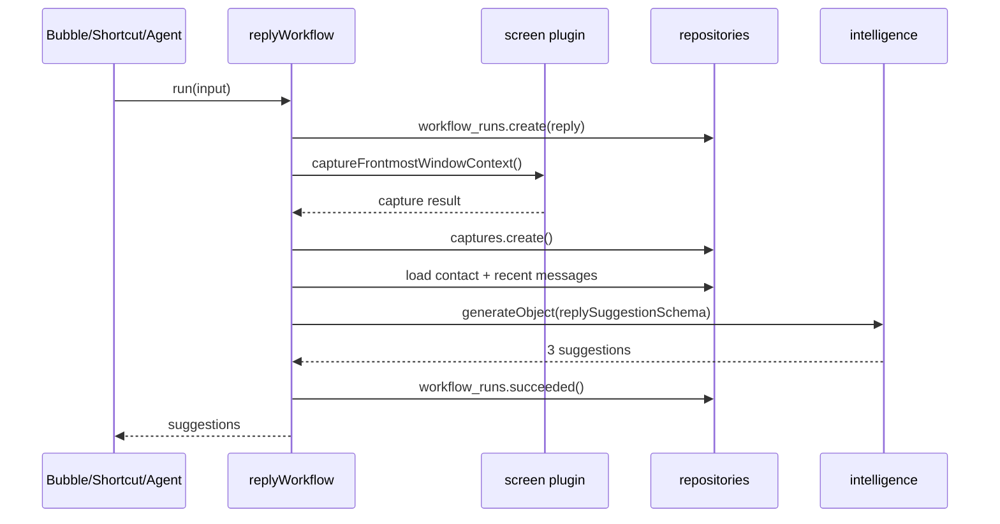
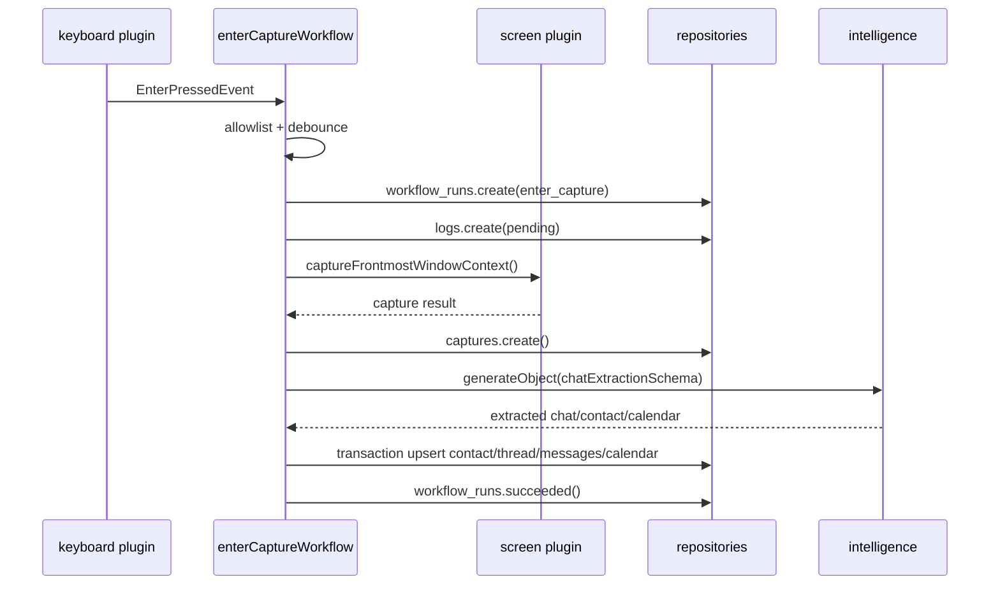

# Percent Core Workflows: Reply Suggestion and Enter Capture

最后更新：2026-06-21  
状态：Draft v0.1  
关联文档：

- `docs/prd-local-first-rebuild.md`
- `docs/technical-architecture-local-first-rebuild.md`

---

## 1. 目标

本文只定义两个核心链路的技术方案：

1. 帮我回 / Reply Suggestion。
2. 按 Enter 留痕 / Enter Capture。

这两个链路是 Percent v2 的 P0 能力，必须从一开始从 UI 组件中拆出来，做成可测试、可审计、可降级的 workflow service。

核心原则：

- UI 只负责触发和展示状态。
- 系统能力由 Tauri plugin 提供。
- 业务 workflow 负责编排。
- 本地 SQLite 是业务真源。
- Zustand 只管理临时 UI/runtime state。
- AI provider 差异只存在于 `intelligence` service，不进入 workflow。

---

## 2. 是否需要 LangGraph

结论：P0 不需要 LangGraph。

原因：

- “帮我回”是一次性短链路：截图、取上下文、生成三条建议、展示。
- “按 Enter 留痕”是确定性事件处理：监听、截图、分析、去重、写库。
- 两者都不需要复杂多 agent 协作、动态路由、长期 planner、循环反思或不确定工具选择。
- 这两个链路更需要事务边界、幂等、失败降级、审计日志，而不是 graph runtime。

推荐实现：

```ts
replyWorkflow.run(input): Promise<Result<ReplyWorkflowOutput, WorkflowError>>
enterCaptureWorkflow.run(event): Promise<Result<EnterCaptureOutput, WorkflowError>>
```

LangGraph 可以作为 P2 选项，只用于未来更复杂的全局右侧 Agent，例如：

- 多步查询联系人、聊天、Calendar。
- 用户让 Agent 主动规划一组整理动作。
- Agent 需要在多个工具之间循环决策。

但 P0 的 Reply / Enter 不应引入 LangGraph。

---

## 3. Shared Architecture

两个 workflow 共用同一套底层能力。

```text
UI / keyboard event
  -> workflow service
  -> repositories
  -> SQLite

workflow service
  -> tauri screen / keyboard / permissions
  -> intelligence service
  -> provider adapter
```

### 3.1 目录建议

```text
apps/client/src/
  services/
    reply/
      replyWorkflow.ts
      replyPrompt.ts
      replySchema.ts
      replyTypes.ts
      replyErrors.ts

    enter-capture/
      enterCaptureWorkflow.ts
      enterCapturePrompt.ts
      enterCaptureSchema.ts
      enterCaptureTypes.ts
      enterCaptureDedupe.ts
      enterCaptureErrors.ts

    capture/
      captureService.ts

    intelligence/
      intelligenceService.ts

  db/repositories/
    workflowRunsRepo.ts
    aiEventsRepo.ts
    logsRepo.ts
    capturesRepo.ts
    contactsRepo.ts
    chatRepo.ts
    calendarRepo.ts

  stores/
    workflowStatusStore.ts
```

### 3.2 不能放在 workflow 里的东西

- Provider-specific request format。
- API key 和 base URL 解析。
- UI toast / modal 操作。
- React state mutation。
- 直接 SQL。
- 自动发送微信消息。

### 3.3 必须由 workflow 负责的东西

- trace id。
- workflow run 创建和状态更新。
- 依赖权限检查。
- 失败降级。
- 幂等和防重。
- repository 事务边界。
- 输出 contract。

---

## 4. Shared Tables

两个 workflow 主要写这些表：

```text
workflow_runs
ai_events
captures
logs
contacts
contact_aliases
chat_threads
chat_messages
calendar_items
```

### 4.1 workflow_runs

每次 workflow 启动必须创建一行。

关键字段：

```text
id
type: "reply" | "enter_capture"
trace_id
status: "running" | "succeeded" | "failed" | "partial"
started_at
completed_at
error_code
error_message
related_capture_id
related_log_id
metadata_json
```

用途：

- 替代散落 console log。
- 支持调试和质量统计。
- 支持失败重试和用户反馈。

### 4.2 ai_events

每次 LLM 调用必须创建一行。

关键字段：

```text
id
workflow_run_id
trace_id
provider_profile_id
provider_type
model
request_kind: "reply_suggestion" | "chat_extraction"
image_attached
status
error_code
latency_ms
redacted_request_preview
redacted_response_preview
created_at
```

规则：

- 不保存 API key。
- 默认不保存完整 prompt。
- 只保存 redacted preview 和结构化错误。

---

## 5. Reply Suggestion / 帮我回

### 5.1 用户目标

用户在当前聊天窗口里不知道如何回复，点击“帮我回”后，Percent 给出三条可复制、可编辑、不会自动发送的建议。

### 5.2 入口

- Bubble 点击“帮我回”。
- 快捷键。
- 右侧 Chat Agent 中触发同一 workflow。

所有入口都调用同一个 `replyWorkflow.run()`。

### 5.3 输入

```ts
type ReplyWorkflowInput = {
  source: "bubble" | "shortcut" | "agent";
  userInstruction?: string;
  targetAppAllowList?: string[];
};
```

### 5.4 输出

```ts
type ReplySuggestion = {
  id: string;
  label: "stable" | "natural" | "short";
  text: string;
  rationale?: string;
};

type ReplyWorkflowOutput = {
  traceId: string;
  workflowRunId: string;
  captureId: string | null;
  contactId: string | null;
  suggestions: ReplySuggestion[];
  warnings: WorkflowWarning[];
};
```

默认三条：

- `stable`：稳妥。
- `natural`：自然。
- `short`：简短。

### 5.5 链路

```text
reply.start
  -> create trace_id
  -> workflow_runs.create(type="reply", status="running")
  -> permissions.check(screen_recording)
  -> providerProfilesRepo.getDefault()
  -> intelligence.requireCapability(image preferred, text required)
  -> screen.captureFrontmostWindowContext()
  -> capturesRepo.create()
  -> identify current contact from screenshot/window/recent history
  -> chatRepo.listRecentMessages(contact/thread)
  -> build reply prompt
  -> intelligence.generateObject(replySuggestionSchema)
  -> validate and normalize suggestions
  -> workflow_runs.markSucceeded()
  -> return suggestions to UI
```

### 5.6 Mermaid



### 5.7 Prompt 输入

Prompt 只能包含必要上下文：

- 当前截图。
- 当前 app / window metadata。
- 最近聊天消息。
- 识别出的联系人信息。
- 用户可选指令。

不应该塞入：

- 全量本地聊天库。
- 无关联系人。
- Settings 明文 key。
- 系统 debug log。

### 5.8 Schema

```ts
const replySuggestionSchema = z.object({
  contact: z.object({
    displayName: z.string().nullable(),
    relationType: z
      .enum(["customer", "coworker", "partner", "friend", "family", "unknown"])
      .default("unknown"),
  }),
  suggestions: z
    .array(
      z.object({
        label: z.enum(["stable", "natural", "short"]),
        text: z.string().min(1).max(500),
        rationale: z.string().optional(),
      }),
    )
    .length(3),
  calendarCandidates: z.array(calendarCandidateSchema).optional(),
});
```

联系人 relation 默认不使用“对象”。只有截图或上下文明确是恋爱关系时，才可在 metadata 中记录原文事实。

### 5.9 状态机

```text
idle
  -> preparing
  -> capturing
  -> loading_context
  -> generating
  -> ready

failed states:
  -> needs_permission
  -> needs_provider
  -> provider_failed
  -> capture_failed
```

Zustand 只存当前 UI 状态：

```ts
type ReplyRuntimeState = {
  status:
    | "idle"
    | "preparing"
    | "capturing"
    | "loading_context"
    | "generating"
    | "ready"
    | "failed";
  activeTraceId: string | null;
  latestWorkflowRunId: string | null;
};
```

suggestions 不应只存在 Zustand。UI 可以临时持有本次结果，但如需历史追踪，应写入 `ai_events` 或专门的 `reply_suggestions` 表。

### 5.10 降级策略

| 场景 | 行为 |
|---|---|
| 无 Screen Recording | 返回 `needs_permission`，不调用 AI |
| 无 provider | 返回 `needs_provider`，引导到 Settings -> Intelligence |
| provider 不支持图片 | 若有本地历史，走 text-only fallback；否则提示当前 provider 不支持截图 |
| 截图失败 | 不生成建议，提示重试 |
| 联系人识别失败 | 用截图直接生成保守建议 |
| 本地历史为空 | 只基于截图生成，但 prompt 必须要求不编造事实 |
| AI 返回不合 schema | 重试一次；仍失败则返回 `invalid_response` |
| 用户连续点击 | 复用当前 running workflow 或取消旧请求后启动新请求 |

### 5.11 幂等与并发

- 同一 UI 入口 3 秒内重复点击，不并发启动多个 reply workflow。
- 每个 workflow 使用唯一 `trace_id`。
- capture 保存一次，不因 AI 重试重复截图。
- AI schema 失败可以用同一 capture 重试一次。
- 用户点击“重新生成”时创建新的 workflow_run，但可复用最近 capture，除非用户要求重新截图。

### 5.12 测试

Unit:

- prompt builder 不泄漏无关上下文。
- provider image unsupported 时走 text-only fallback。
- schema parser 能拒绝少于三条建议。
- relationType 不默认输出“对象”。

Integration:

- mock screen capture + mock intelligence 返回三条建议。
- provider failure 写入 workflow_runs failed 和 ai_events failed。
- no provider 不调用 screen/AI。

Manual:

- WeChat 当前窗口点击“帮我回”。
- 非微信窗口点击“帮我回”。
- provider 不支持图片。
- 连续快速点击。

---

## 6. Enter Capture / 按 Enter 留痕

### 6.1 用户目标

用户在 WeChat 等 IM 中按 Enter 发送消息后，Percent 自动记录这次聊天上下文，用于之后的联系人记忆、问屏幕、Calendar 和回复建议。

### 6.2 入口

入口不是 React UI，而是 macOS keyboard event tap。

```text
keyboard plugin
  -> enter pressed event
  -> enterCaptureWorkflow.run(event)
```

keyboard plugin 只负责发事件，不做截图、不调 AI、不写业务表。

### 6.3 输入

```ts
type EnterPressedEvent = {
  eventId: string;
  occurredAtMs: number;
  frontmostAppName: string;
  frontmostBundleId: string;
  windowTitle?: string;
  keyCode: number;
  modifiers: string[];
};
```

### 6.4 输出

```ts
type EnterCaptureOutput = {
  traceId: string;
  workflowRunId: string;
  logId: string;
  captureId: string | null;
  contactId: string | null;
  chatThreadId: string | null;
  messageIds: string[];
  calendarItemIds: string[];
  status: "analyzed" | "capture_only" | "event_only" | "partial";
  warnings: WorkflowWarning[];
};
```

### 6.5 链路

```text
keyboard.enterPressed
  -> validate feature enabled
  -> validate app allowlist
  -> debounce / dedupe event
  -> create trace_id
  -> workflow_runs.create(type="enter_capture")
  -> logsRepo.create(status="pending")
  -> permissions.check(screen_recording)
  -> screen.captureFrontmostWindowContext()
  -> capturesRepo.create()
  -> providerProfilesRepo.getDefault()
  -> if no provider: mark capture_only
  -> intelligence.generateObject(chatExtractionSchema)
  -> validate extracted result
  -> transaction:
       contactsRepo.upsertDetectedContact()
       chatRepo.upsertThread()
       chatRepo.appendDetectedMessages()
       calendarRepo.createSuggestedItems()
       logsRepo.markAnalyzed()
  -> workflow_runs.markSucceeded()
```

### 6.6 Mermaid



### 6.7 App Allowlist

P0 支持：

```text
com.tencent.xinWeChat
```

P1 可增加：

```text
com.tencent.WeWorkMac
com.apple.MobileSMS
com.feishu.mac
```

allowlist 放 Settings -> App，不写死在 workflow 中。workflow 只读取设置结果。

### 6.8 Debounce / Dedupe

Enter 事件必须防重，否则会出现一次发送多次截图分析。

规则：

- 同一 bundle id + window title + 800ms 内只处理一次。
- IME composition 状态下不触发。
- Shift+Enter / Option+Enter 默认不触发，除非用户设置。
- 只处理 key up 或 key down 其中一种，不能两者都处理。
- 如果上一个 enter_capture 仍在 running，允许排队最多 1 个最新事件，旧的 pending 事件丢弃。

推荐 dedupe key：

```ts
const dedupeKey = hash([
  event.frontmostBundleId,
  event.windowTitle ?? "",
  Math.floor(event.occurredAtMs / 800),
]);
```

`dedupeKey` 应写入 `workflow_runs.metadata_json` 或 `logs.metadata_json`。

### 6.9 Chat Extraction Schema

```ts
const chatExtractionSchema = z.object({
  app: z.object({
    name: z.string(),
    bundleId: z.string(),
  }),
  contact: z.object({
    displayName: z.string().nullable(),
    aliases: z.array(z.string()).default([]),
    relationType: z
      .enum(["customer", "coworker", "partner", "friend", "family", "unknown"])
      .default("unknown"),
    confidence: z.number().min(0).max(1),
  }),
  messages: z.array(
    z.object({
      sender: z.enum(["me", "them", "unknown"]),
      text: z.string(),
      occurredAtText: z.string().nullable(),
      confidence: z.number().min(0).max(1),
    }),
  ),
  calendarCandidates: z.array(calendarCandidateSchema).default([]),
  summary: z.string().max(500).optional(),
});
```

### 6.10 写库事务

AI 分析成功后的结构化写入必须在事务中完成。

```text
transaction:
  contact = contactsRepo.upsertDetectedContact()
  thread = chatRepo.upsertThread(contact, app/window)
  messages = chatRepo.appendDetectedMessages(thread, messages, dedupe)
  calendarItems = calendarRepo.createSuggestedItems(candidates, dedupe)
  logsRepo.markAnalyzed(logId, contact/thread/capture)
```

如果事务失败：

- `workflow_runs.status = "partial"` 或 `"failed"`。
- `logs.status = "analyze_succeeded_persist_failed"`。
- 不删除 capture。
- 不删除 ai_event。

### 6.11 Contact Dedupe

联系人去重分三层。

1. 精确匹配：
   - same app + same displayName。
   - same alias。
   - existing chat_thread current window title match。

2. 软匹配：
   - displayName 相似。
   - 最近 24 小时内同一个窗口标题。
   - AI 输出 relation 和上下文相近。

3. 人工确认：
   - 低置信合并只生成 `contact_merge_candidates`。
   - 不自动合并两个高价值联系人。

P0 可以先做精确匹配 + 低置信不合并。

### 6.12 Chat Message Dedupe

截图解析可能每次包含多条历史消息，不能每次全量重复写入。

推荐 key：

```ts
message_dedupe_key = hash([
  thread_id,
  normalized_text,
  sender,
  approximate_occurred_bucket,
]);
```

规则：

- 文本 normalize：trim、合并空白、去掉不可见字符。
- 时间不明确时，使用 capture time 的 10 分钟 bucket。
- 同一 thread 内相同 key 不重复写。
- 如果 AI 置信度低于阈值，只写入 raw extraction metadata，不进正式 `chat_messages`。

### 6.13 Calendar Candidate Dedupe

聊天里出现时间承诺时，创建本地 suggested item，不直接写 Apple Calendar。

推荐 key：

```ts
calendar_dedupe_key = hash([
  contact_id,
  normalized_title,
  start_time_bucket,
  source_chat_message_id ?? source_log_id,
]);
```

规则：

- P0 默认 `status = "suggested"`。
- 用户确认后才写 Apple Calendar。
- Apple Calendar 写入成功后保存 external_event_id。
- 同一候选重复出现时更新 confidence/source，不重复展示。

### 6.14 状态机

```text
idle
  -> received
  -> filtering
  -> logging
  -> capturing
  -> analyzing
  -> persisting
  -> succeeded

degraded:
  -> ignored
  -> event_only
  -> capture_only
  -> analyze_failed
  -> persist_failed
```

UI 不需要显示每一次 Enter 的完整状态。Home 或 debug/status 区只展示聚合状态，例如：

- 最近一次记录成功。
- 最近一次分析失败。
- 权限缺失。
- provider 未配置。

### 6.15 降级策略

| 场景 | 行为 |
|---|---|
| 功能关闭 | 直接 ignore，不写库 |
| unsupported app | ignore 或 minimal log，取决于设置 |
| Input Monitoring 无权限 | keyboard plugin 不启动，Settings 显示缺失 |
| Accessibility 无权限 | 无法可靠识别前台窗口时禁用 Enter capture |
| Screen Recording 无权限 | 写 event-only log |
| 截图失败 | 写 event-only log，workflow partial |
| 无 provider | 写 capture-only log |
| provider 不支持图片 | 写 capture-only log，提示 Intelligence image test |
| AI 失败 | log 标记 analyze_failed，capture 保留 |
| AI schema 错误 | 重试一次；仍失败则 analyze_failed |
| DB 事务失败 | mark persist_failed，不删除 capture/ai_event |

### 6.16 队列与背压

Enter capture 是后台链路，不应拖慢用户输入。

规则：

- keyboard plugin 发事件后立即返回。
- workflow 在 JS/Rust side async queue 中处理。
- 同一窗口最多保留 1 个 pending enter event。
- queue 全局最大长度建议 5。
- 超过队列上限时丢弃最旧 pending，并写 `workflow_runs` skipped metadata。
- AI 分析可以后台串行，避免多张截图同时打 provider。

P0 可以实现轻量 queue：

```ts
enterCaptureQueue.enqueue(event)
enterCaptureQueue.processOneAtATime()
```

不要把 queue 状态放在 React component。

### 6.17 测试

Unit:

- allowlist filter。
- debounce key。
- message dedupe。
- calendar dedupe。
- contact exact match。
- missing provider -> capture_only。
- no screen permission -> event_only。

Integration:

- mock keyboard event -> mock screen -> mock intelligence -> writes contact/thread/message。
- provider failure writes analyze_failed。
- DB transaction failure writes persist_failed。
- repeated Enter within 800ms only creates one workflow_run。

Manual:

- WeChat 单次 Enter。
- WeChat 快速连续 Enter。
- Shift+Enter 不触发。
- 关闭 Screen Recording。
- 关闭 provider。
- 多显示器 / 不同 Spaces。

---

## 7. Relationship Between Reply and Enter

两个 workflow 共享数据，但不能互相强依赖。

```text
Enter Capture
  -> 持续沉淀 contacts / chat_messages / calendar_items

Reply Suggestion
  -> 读取 contacts / chat_messages
  -> 结合当前截图生成建议
```

设计规则：

- Reply 不能要求 Enter 历史必须存在。
- Enter 失败不影响用户手动点击 Reply。
- Reply 可以复用当前 capture，但不能把 reply result 当作已发送消息写入聊天历史。
- 只有用户后续真的按 Enter 发送，Enter Capture 才记录发送后的上下文。

---

## 8. Anarlog Reference Mapping

可参考：

- Screen capture：
  - `~/maidang/anarlog/plugins/screen/src/commands.rs`
  - `~/maidang/anarlog/crates/screen-core/src/lib.rs`

- Permissions：
  - `~/maidang/anarlog/plugins/permissions/src/commands.rs`
  - `~/maidang/anarlog/apps/desktop/src/shared/hooks/usePermissions.ts`

- Shortcut/event pattern：
  - `~/maidang/anarlog/plugins/shortcut/src/handler.rs`

- AI provider / BYOK：
  - `~/maidang/anarlog/apps/desktop/src/settings/ai/llm/shared.tsx`
  - `~/maidang/anarlog/apps/desktop/src/ai/hooks/useLLMConnection.ts`
  - `~/maidang/anarlog/apps/desktop/src/settings/ai/shared/model-capabilities.ts`

- Chat panel / tools：
  - `~/maidang/anarlog/apps/desktop/src/chat/transport/index.ts`
  - `~/maidang/anarlog/apps/desktop/src/chat/tools/index.ts`
  - `~/maidang/anarlog/apps/desktop/src/contexts/tool-registry/core.ts`

不能直接照抄：

- WeChat Enter capture：anarlog 没有这个完整业务链路。
- 聊天截图解析：Percent 需要自己的 schema/prompt/dedupe。
- 客户识别：Percent 需要中文 IM 场景和“客户”口径。
- 回复建议：Percent 需要产品化三条建议和不自动发送约束。

---

## 9. Implementation Order

建议顺序：

1. 建 `workflow_runs` / `ai_events` / `captures` / `logs` repository。
2. 建 `intelligence.generateObject()` 统一接口。
3. 建 `captureService.captureFrontmost()`。
4. 实现 `replyWorkflow`，先跑通手动点击链路。
5. 实现 keyboard plugin 和 `enterCaptureQueue`。
6. 实现 `enterCaptureWorkflow` capture-only。
7. 加 chat extraction schema 和结构化写库。
8. 加 contact/message/calendar dedupe。
9. 加 Settings 中权限和 provider 状态提示。

这样可以先验证 AI/provider/capture 链路，再接入更复杂的 Enter 事件流。

---

## 10. Final Recommendation

“帮我回”和“按 Enter 留痕”都应该是明确的 workflow service，而不是 ChatWindow 状态机，也不是 LangGraph agent。

P0 最重要的是：

- 触发清楚。
- 状态清楚。
- 数据写入清楚。
- provider 差异隔离。
- 失败可降级。
- 每次运行可审计。

等右侧全局 Agent 真的出现多步工具调用和动态规划需求，再考虑 LangGraph 或类似 graph runtime。
